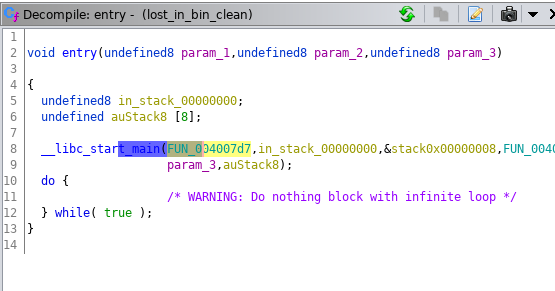
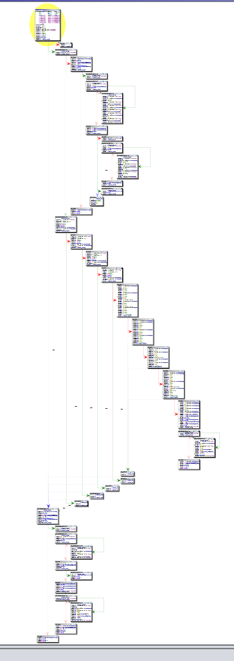

# [80 points] [Hard] Lost in the binary

_By [ramza500](https://ctflearn.com/user/ramza500)._

## Description

I lost a flag inside this binary, please help me to find it. If you trigger certain anti-debugging techniques, you might get false flags…. flag format: FLAG-(str) [link to binary](https://mega.nz/#!ifgzQQCC!E1W0cSOFRvi7bE_v419rzwQB2jAHF0IsIRAWL6H1RNE). 

## Solution

Upon downloading, we quickly realise that this is a stripped 64-bit ELF binary (`file lost_in_bin`). This means that we don't have access to the symbols, making debugging a bit harder.

Anywho, after that, I quickly opened it in _ghidra_ (free reverse engineering tool released by the NSA. Great alternative to IDAPro as it provides a lot of the same features, without the harsh price tag). Simply click along, and go with the default analyzer settings + "Decompiler Parameter ID". It warns you about taking a lot of time, but it won't. 

Now we're left with this, which may be a bit daunting if you're not familiar with the program.


First we notice in the functions panel that there is no main, but that's easily solved by looking at the very obvious `__libc_start_main` function;


We see that the decompiler can't make sense of this, but by hitting `a` for analyze, and simply clicking ok, we see that it manages to make sense of this, and we quickly see that it's called with a reference to another function, which we can then deduce to be `main`. I use the hotkey `f` to bring up the "Edit Function" dialog, and set the return value and parameters to the standard for a `C` program.




Now, let's take a look at the disassembly graph, this will help us understand the flow of the program. We also know that it will return an incorrect flag if you try to debug it, so let's keep that in mind.



Alright, so we know that there is an `if` statement in the first code chunk that will redirect to the bottom one, and one for (almost) every subsequent chunk. From this, we can assume that this is a common endpoint if the user inputs something incorrect, so this is what we want to avoid. 

This honestly took me quite a lot of time to realise, as there is a complete program at the bottom for checking the password, and it even returns a flag, but it's simply a decoy.

We can also learn this from the first call to `ptrace`; if `ptrace` is unable to trace itself (if e.g. running the program with `radare`, `gdb`, `strace`, `ltrace`, etc.), it will fall to the bottom branch. This should have been the first tell, but I didn't realise what it meant until a lot later.

By looking at the decompiled code, which is one of `ghidra`s strengths, we quickly see the call to `ptrace`, and the subsequent check;


By checking the `man`-page of `ptrace`, we see that `-1` is returned on failure (this is also common practise in C).

```
PTRACE(2)                                                                                 Linux Programmer's Manual                                                                                 PTRACE(2)

NAME
       ptrace - process trace

       .
       .
       .


RETURN VALUE
       [...]

       On error, all requests return -1, and errno is set appropriately.  [...]
```

Next, let's clean up. We know by checking the `man`-page of `scanf` that the second parameter is a reference to the buffer in which to store the users input, and the first is the format.

We then use `l` in _ghidra_ with the cursor on the symbol to rename it, this makes solving this a whole lot easier.

We then check out the block starting on `L16` (**SPOILER**: This is not part of the soution, it's just obfuscated code eventually printing "missing arguments").

We start by renaming the obvious iterator before the while loop to `i` for easier reading.

We see that it loops from `0` to `16`, which is a bit strange, as it allows a string of `17` chars, which is not possible in the other functions. This should perhaps have been a red flag.

Anywho, we quickly see that we compare a string stored in the program to a modified version of the string we provided. We can follow the reference to the string, and since we know it's a string, we mark `9B`, and click the "Create Array" button, and follow it with "Set Data Type", and set it to `char[9]`.


Let's solve this real quick;

```python
solution = [0x97, 0x9B, ...]

for s in solution:
    for i in range(-0xff, 0xff):
        if ~((i ^ 0x2) + 0x1) == s:
            print hex(i)
            break
```

Now we have the solution to this part, but if we run the program with the result, or try to reverse the next part (which I sadly did), we realise that it's just stupid obfuscated code which prints "missing arguments".

Alright, let's skip down to the part where the user provides 4 arguments to the binary (it checks 5 as `argv[0]` always is the path to the binary).


**oh-shit.bmp** -- That looks bad. But don't worry, it's actually quite simple. Let's start from the top, and rename the `DAT_*` variables to what they really are, `num_1, num_2, num_3, num_4`.

We can check the `man`-pages to find out that `strtol` takes a string, length to scan, and base, and converts a string to a long. We can also read from the `man`-pages that `0x0` as the second argument will force it to scan until it finds a `0x0` (null-byte). C-strings are null-byte-terminated, so this will simply read one long at the time.

Let's copy this out into a C-file and clean up a bit:

```c
if ( 
        ((((num_4 * -0xc + num_1 * -0x18 + num_2 * -0x12 + num_3 * -0xf == 0xffffb827)))) &&
        ((num_4 * -9 + (num_1 + num_2) * 0x12 + num_3 * 9 == 0x1143 &&
                   ((num_4 * 2 + num_1 * 0x10 + num_2 * 0xc + num_3 * 4 == 0x1c84 &&
                                (num_4 * -0xb + (num_1 + num_2) * -6 + num_3 * -3 == 0xffffde5b)))))
) {
    result = (num_1 * num_2 + num_3) - num_4;
} 
```

Still a bit cluttered though. Let's write it as math instead;

```
num_4 * (-12) + num_1 * (-24) + num_2 * (-18) + num_3 * (-15) = -18393

num_4 * (-9) + (num_1 + num_2) * 18 + num_3 * 9 = 4419

num_4*2 + num_1 * 16 + num_2 * 12 + num_3 * 4 = 7300

num_4 * (-11) + (num_1 + num_2) * (-6) + num_3 * -3 = -8613
```

And use `x,y,z,w` instead of `num_n`;

```
w * (-12) + x * (-24) + y * (-18) + z * (-15) = -18393
w * (-9) + (x + y) * 18 + z * 9 = 4419
w*2 + x * 16 + y * 12 + z * 4 = 7300
w * (-11) + (x + y) * (-6) + z * -3 = -8613
```

Let's slam it into one line and feed it into wolframalpha; no way I'm doing this by hand.


TADA! We have out arguments. Let's try it out.

```bash
$ ./lost_in_bin 227 115 317 510
FLAG-21a84f2c7c7fd432edf1686215db05ea
```

And it works, 80 points to me :^)