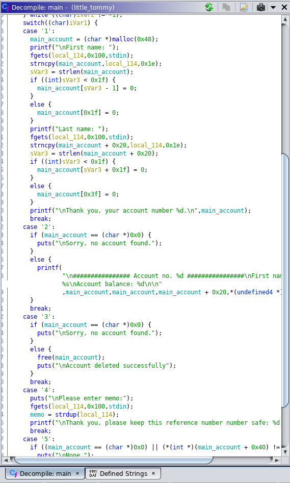

# [40 points] Little Tommy

We're handed a 32-bit ELF binary.

Upon opening and analyzing, we see that it's a tiny program for tracking accounts.

By looking at the print file command, we see that we need the balance to `0x6b637566`, and the account to exist.



There is no way of setting the balance, but we quickly see that memory is allocated using `malloc` when creating a new user.

`0x0->-0x3f` is used for first and last name, whereas `0x40->0x48` is used for the balance.

When deleting the user, `free` is called with a pointer to the struct. However, the memory is not overwritten, which means we can use the remaining `memo` command to overwrite the memory, and then finally create a new user!

The reason this works is because the `memo` command uses `strdup`, which according to the manpage (`man 3 strdup`) works as follows:

>The strdup() function returns a pointer to a new string which is a duplicate of the string s. Memory for the new string is obtained with malloc(3), and can be freed with free(3).

So, game plan is to create an account, delete it, add a memo with `0x40` padding, and then add that is checked by the program ('fuck' in hex).

This can be done in a one-liner in python:

```
"a"*0x40 + '\x66\x75\x63\x6b'
```

Let's try this on the server:

```
python -c 'print "1\n\n\n3\n4\n"+"a"*0x40+"\x66\x75\x63\x6b"+"\n5\n' | nc docker.hackthebox.eu 43563
```

Ka-ching!
